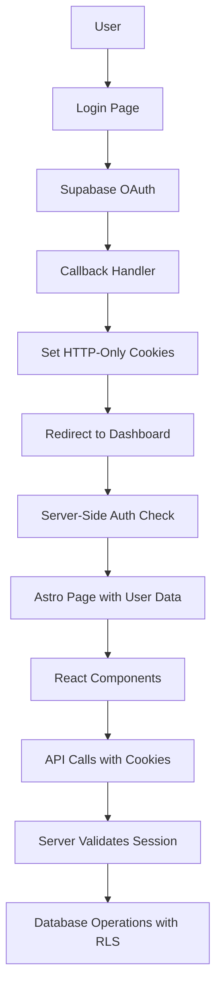

# Authentication Implementation Plan - MyFreezer

## Overview

This document outlines the recommended authentication architecture for the MyFreezer application using Supabase with Astro 5 + React 19. The approach prioritizes security, SSR compatibility, and seamless integration with Row Level Security (RLS) policies.

## Recommended Solution: Server-Side Authentication with HTTP-Only Cookies

### Architecture Principles

1. **Server-Side First**: Authentication handled primarily on the server
2. **HTTP-Only Cookies**: Secure session storage preventing XSS attacks
3. **Supabase Native**: Use Supabase's built-in OAuth and session management
4. **SSR Compatible**: Works seamlessly with Astro's server-side rendering
5. **RLS Ready**: Automatic compatibility with existing RLS policies

## Authentication Flow Diagram



## Implementation Plan

### Phase 1: Server-Side Supabase Client

**File**: `src/lib/auth/supabase-server.ts`

```typescript
import { createServerClient } from '@supabase/ssr'
import type { Database } from '../db/database.types.js'

export function createSupabaseServerClient(request: Request) {
  return createServerClient<Database>(
    import.meta.env.PUBLIC_SUPABASE_URL!,
    import.meta.env.SUPABASE_ANON_KEY!,
    {
      cookies: {
        get(name: string) {
          const cookieHeader = request.headers.get('cookie');
          if (!cookieHeader) return undefined;
          
          const cookies = Object.fromEntries(
            cookieHeader.split('; ').map(cookie => {
              const [key, value] = cookie.split('=');
              return [key, decodeURIComponent(value)];
            })
          );
          
          return cookies[name];
        },
        set() {
          // Cookies are set in the response, not here
        },
        remove() {
          // Cookies are removed in the response, not here
        }
      }
    }
  );
}

export function createSupabaseAdminClient() {
  return createServerClient<Database>(
    import.meta.env.PUBLIC_SUPABASE_URL!,
    import.meta.env.SUPABASE_SERVICE_ROLE_KEY!,
    {
      cookies: {
        get: () => undefined,
        set: () => {},
        remove: () => {}
      }
    }
  );
}
```

### Phase 2: OAuth Flow with Secure Cookies

**File**: `src/pages/api/auth/google.ts`

```typescript
import type { APIRoute } from 'astro';
import { createSupabaseServerClient } from '../../../lib/auth/supabase-server.js';

export const GET: APIRoute = async ({ redirect, url }) => {
  const supabase = createSupabaseServerClient(new Request(url));
  
  const redirectTo = url.searchParams.get('redirect') || `${url.origin}/dashboard`;
  
  const { data, error } = await supabase.auth.signInWithOAuth({
    provider: 'google',
    options: {
      redirectTo: `${url.origin}/api/auth/callback`,
      queryParams: {
        redirect_to: redirectTo,
      },
    },
  });

  if (error) {
    console.error('Google OAuth initiation error:', error);
    return redirect('/login?error=oauth_failed');
  }

  if (data.url) {
    return redirect(data.url);
  }

  return redirect('/login?error=oauth_failed');
};
```

**File**: `src/pages/api/auth/callback.ts`

```typescript
import type { APIRoute } from 'astro';
import { createSupabaseServerClient } from '../../../lib/auth/supabase-server.js';

export const GET: APIRoute = async ({ url, redirect, cookies }) => {
  const supabase = createSupabaseServerClient(new Request(url));
  
  const code = url.searchParams.get('code');
  const error = url.searchParams.get('error');
  const redirectTo = url.searchParams.get('redirect_to') || '/dashboard';

  if (error) {
    console.error('OAuth error:', error);
    return redirect('/login?error=oauth_failed');
  }

  if (!code) {
    console.error('No authorization code received');
    return redirect('/login?error=oauth_failed');
  }

  try {
    const { data, error: authError } = await supabase.auth.exchangeCodeForSession(code);

    if (authError || !data.session) {
      console.error('Failed to exchange code for session:', authError);
      return redirect('/login?error=oauth_failed');
    }

    // Set secure HTTP-only cookies
    const { access_token, refresh_token } = data.session;
    
    cookies.set('sb-access-token', access_token, {
      httpOnly: true,
      secure: import.meta.env.NODE_ENV === 'production',
      sameSite: 'lax',
      maxAge: 60 * 60, // 1 hour
      path: '/'
    });

    cookies.set('sb-refresh-token', refresh_token, {
      httpOnly: true,
      secure: import.meta.env.NODE_ENV === 'production',
      sameSite: 'lax',
      maxAge: 60 * 60 * 24 * 7, // 1 week
      path: '/'
    });

    console.log('✅ OAuth success:', data.user?.email);
    return redirect(redirectTo);

  } catch (error) {
    console.error('OAuth callback error:', error);
    return redirect('/login?error=oauth_failed');
  }
};
```

### Phase 3: Updated Authentication Utilities

**File**: `src/lib/auth.utils.ts`

```typescript
import type { SupabaseClient } from "@supabase/supabase-js";
import type { Database } from "../db/database.types.js";
import { createSupabaseServerClient } from "./auth/supabase-server.js";

export interface AuthResult {
  success: boolean;
  user_id?: string;
  error?: string;
}

/**
 * Validate authentication using Supabase server client
 */
export async function validateAuthToken(request: Request): Promise<AuthResult> {
  try {
    const supabase = createSupabaseServerClient(request);
    const { data: { user }, error } = await supabase.auth.getUser();

    if (error || !user) {
      return {
        success: false,
        error: error?.message || "Not authenticated",
      };
    }

    return {
      success: true,
      user_id: user.id,
    };
  } catch (error) {
    console.error("Authentication validation error:", error);
    return {
      success: false,
      error: "Authentication validation failed",
    };
  }
}

/**
 * Create standardized error responses
 */
export function createErrorResponse(status: number, message: string): Response {
  return new Response(JSON.stringify({ error: message }), {
    status,
    headers: {
      "Content-Type": "application/json",
    },
  });
}

/**
 * Create standardized success responses
 */
export function createSuccessResponse<T = unknown>(data: T, status = 200): Response {
  return new Response(JSON.stringify(data), {
    status,
    headers: {
      "Content-Type": "application/json",
    },
  });
}
```

### Phase 4: Protected API Routes

**File**: `src/pages/api/containers/index.ts`

```typescript
export const POST: APIRoute = async ({ locals, request }) => {
  try {
    // Validate authentication using the new approach
    const authResult = await validateAuthToken(request);
    if (!authResult.success) {
      return createErrorResponse(401, authResult.error || "Unauthorized");
    }

    // Parse request body
    const body: CreateContainerCommandDTO = await request.json();

    // Validate input
    if (!body.name || typeof body.name !== "string" || body.name.trim() === "") {
      return createErrorResponse(400, "Name is required and cannot be empty");
    }

    // Create container using Supabase server client
    const supabase = createSupabaseServerClient(request);
    
    const { data, error } = await supabase
      .from("containers")
      .insert({
        name: body.name.trim(),
        type: body.type || "freezer",
        user_id: authResult.user_id!, // This will now work with RLS
      })
      .select("container_id, name, type, created_at")
      .single();

    if (error) {
      throw new Error(`Failed to create container: ${error.message}`);
    }

    return createSuccessResponse(data, 201);
  } catch (error) {
    console.error("Create container error:", error);
    return createErrorResponse(500, "Internal server error");
  }
};
```

### Phase 5: Client-Side Integration

**File**: `src/lib/hooks/useDashboard.ts`

```typescript
import { useState, useEffect } from 'react';

interface User {
  id: string;
  email: string;
}

interface AuthStatus {
  authenticated: boolean;
  user?: User;
}

export function useDashboard() {
  const [authStatus, setAuthStatus] = useState<AuthStatus | null>(null);
  const [isLoading, setIsLoading] = useState(true);

  const checkAuthStatus = async () => {
    try {
      const response = await fetch('/api/auth/status', {
        credentials: 'include' // Important: include cookies
      });

      if (response.ok) {
        const data = await response.json();
        setAuthStatus(data);
      } else {
        setAuthStatus({ authenticated: false });
      }
    } catch (error) {
      console.error('Auth check failed:', error);
      setAuthStatus({ authenticated: false });
    } finally {
      setIsLoading(false);
    }
  };

  useEffect(() => {
    checkAuthStatus();
  }, []);

  return {
    isAuthenticated: authStatus?.authenticated || false,
    user: authStatus?.user,
    isLoading,
    refreshAuth: checkAuthStatus
  };
}
```

### Phase 6: Middleware for Protected Routes

**File**: `src/middleware.ts`

```typescript
import { defineMiddleware } from 'astro:middleware';
import { createSupabaseServerClient } from './lib/auth/supabase-server.js';

export const onRequest = defineMiddleware(async ({ request, redirect }, next) => {
  const url = new URL(request.url);
  
  // Check if this is a protected route
  const protectedRoutes = ['/dashboard'];
  const isProtectedRoute = protectedRoutes.some(route => 
    url.pathname.startsWith(route)
  );

  if (isProtectedRoute) {
    const supabase = createSupabaseServerClient(request);
    const { data: { user }, error } = await supabase.auth.getUser();

    if (error || !user) {
      return redirect('/login?error=unauthorized');
    }
  }

  return next();
});
```

## Benefits of This Approach

### 1. **Security**
- HTTP-only cookies prevent XSS attacks
- Secure token storage
- Proper CSRF protection with SameSite cookies

### 2. **SSR Compatibility**
- Works seamlessly with Astro's server-side rendering
- Pages can be pre-rendered with user data
- Better SEO and performance

### 3. **RLS Integration**
- Automatic compatibility with existing RLS policies
- `auth.uid()` works correctly in database queries
- No need to modify existing database schema

### 4. **Developer Experience**
- Clean separation between server and client auth logic
- Consistent error handling
- Easy to test and debug

### 5. **Performance**
- Reduced client-side JavaScript
- Faster initial page loads
- Better caching strategies

## Migration Steps

### Step 1: Update Dependencies
```bash
npm install @supabase/ssr
```

### Step 2: Remove Custom OAuth Implementation
- Delete `src/lib/auth/google.ts`
- Remove `googleapis` dependency
- Delete custom session tables migration
- Remove `user_sessions` and `profiles` tables

### Step 3: Implement New Authentication Flow
- Create server-side Supabase client
- Update OAuth endpoints
- Modify authentication utilities
- Update API routes

### Step 4: Update Client-Side Code
- Modify `useDashboard` hook
- Update login components
- Add proper error handling

### Step 5: Configure Supabase
- Set up Google OAuth in Supabase dashboard
- Add redirect URLs
- Configure RLS policies (existing ones will work)

### Step 6: Test and Deploy
- Test OAuth flow
- Verify container creation works
- Test all protected routes
- Deploy to production

## Environment Variables Required

```bash
# Public (client-side)
PUBLIC_SUPABASE_URL=your_supabase_url
PUBLIC_SUPABASE_ANON_KEY=your_anon_key

# Private (server-side only)
SUPABASE_SERVICE_ROLE_KEY=your_service_role_key
```

## Security Considerations

1. **Cookie Security**: Always use `httpOnly`, `secure`, and `sameSite` flags
2. **Token Refresh**: Implement automatic token refresh logic
3. **Logout**: Clear all authentication cookies
4. **CORS**: Configure proper CORS settings for production
5. **Rate Limiting**: Implement rate limiting on auth endpoints

## Testing Strategy

1. **Unit Tests**: Test authentication utilities
2. **Integration Tests**: Test OAuth flow end-to-end
3. **Security Tests**: Verify cookie security settings
4. **RLS Tests**: Confirm database policies work correctly
5. **Load Tests**: Test authentication under load

This implementation plan provides a secure, scalable, and maintainable authentication system that will resolve the current RLS policy issues and provide a solid foundation for future features. 